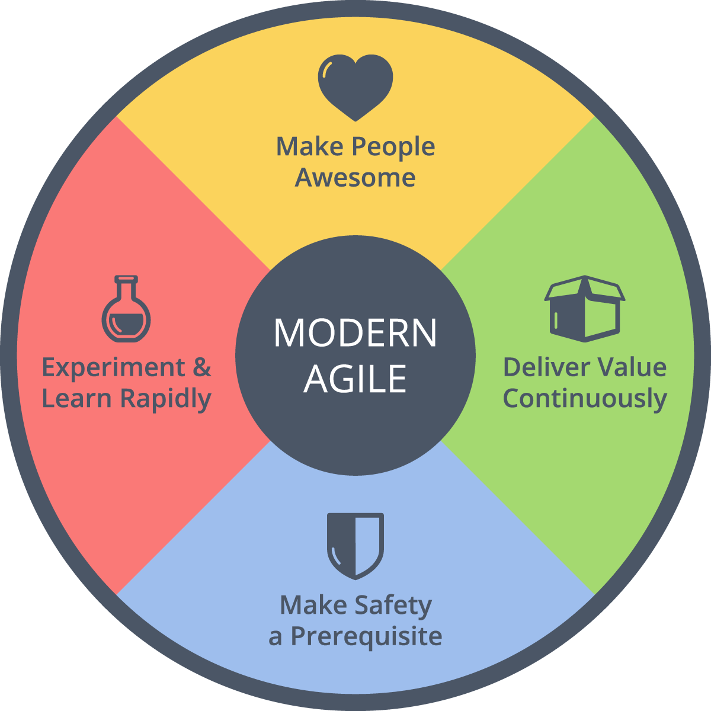
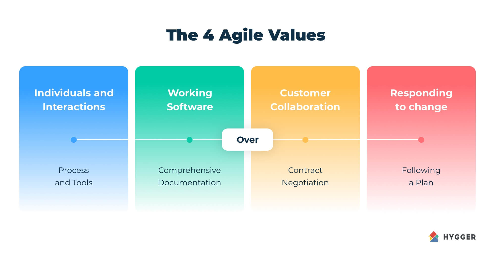
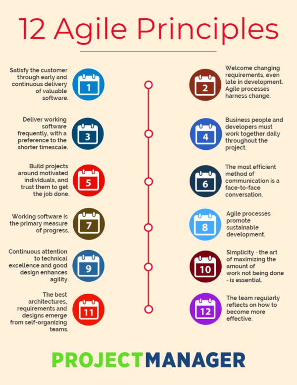
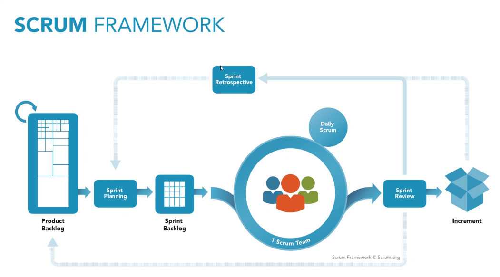
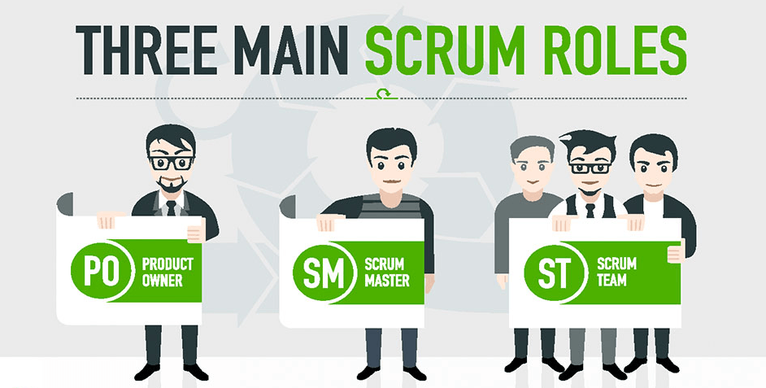

# tech201_agile_and_scrum
Agile and SCRUM notes.

## What is Agile? What is SCRUM?

 

## ***Agile***  

 

### *Personal Research:* 

**Agile** *methodology* is a project management framework that breaks projects down into several dynamic phases, commonly known as sprints. The Agile framework is an iterative methodology. After every sprint, teams reflect and look back to see if there was anything that could be improved so they can adjust their strategy for the next sprint. 

*Methods*:  
- a. **SCRUM** (clearly defined roles and responsibilities), 
- b. **KANBAN** (way of visualizing and improving your current working practices so that work flows through a system quickly), 
- c. **LEAN**(reduce waste, deliver quick, learn and improve, evidence and data used to make decisions).
etc.

*Practices*: 
- Pan on multiple levels and prioritize customer collab; 
- Cascade power downwards, use time ranges and probability; 
- Enable transparency by connecting planning and execution. 

*Frameworks*: 
- SCRUM
- Lean 
- Kanban 
- XP(Extreme Programming)
- Crystal
- DSDM(Dynamic System Development Method)
- FDD(Feature Driven Development)
- etc.

*Techniques*: 
- Daily Standup
- Sprint Planning meetings
- Team Review (show and tell)
- Retrospective meetings
- End-of-phase retrospective
- User stories
- The backlog
- Team walls (a wall where you keep record of your work). 

 

 

### *Course information:* 

**Agile** is not one particular tool, practice or method, but a *MINDSET* inspired by the agile manifesto.  

- SDs in 80s&90s experienced high levels of failed projects and noticed some common traits: too much analysis upfront, restrictive change control (the requirements were set in stone), too much uncertainty. 

- SDs started collaborating and experimenting with new ways of working. They took the successful ideas and wrote them down in a set of underlying values and principles: The Agile Manifesto for Software Development.   

 

#### *Values:*  

1. **Individuals & interactions** over processes and tools - It`s more valuable to communicate and discuss with each other and customers, and build strong collaborations, rather than worrying about how we implement or do something.  

2. **Working software** over comprehensive documentation – It`s more valuable to have software that works 100% of the time and it is easy to use, rather than having a huge manual that teaches you how to use a software that barely works and is hard to use. 

3. **Customer collaboration** over contract negotiation – It`s more valuable to take on bord changes and be flexible with adding or removing things from a project, rather than setting in stone what needs to be done in the moment and setting restrictions and set yourself up for failure.  

4. **Responding to change** over following a plan – It`s better to create changes rather than following a plan, considering that the technology is constantly evolving. 

 

#### *12 Principles:*  

 

 

 

## ***SCRUM*** 

 

**Scrum** is a team based framework to develop complex systems and products.  

Particularities:
- *Sprint*= one week(small projects)/ few weeks(bigger projects).  

- *Products backlog*(the whole plan) -> Sprint Planning(How you are going to attack the backlog and divide it+ decide on sprint length) ->Sprint Backlog(small chunks of the backlog divided either daily or weekly) ->Daily tasks (Daily Scrum) = Assigned to 1 SCRUM team-> Sprint Reviews (at the end of the Sprint where you see where the team is and where is the project, done or not?) -> 2 pathways: Increment (If you go into a new version of the software) or Sprint Retrospective (where you decide if you worked well or not, what went well and what did not, why things haven`t been finished and how we assign it to finish it on time, etc.) (then you go back to Sprint Planning). 

- *Artifacts*  (ways of showcasing where we are in the project) 

 

#### *The 3 Pillars of SCRUM:* 

1. **Transparency** = everyone presents the facts as is and collectively collaborates for the common organizational objective. Nobody can have a hidden agenda! 

2. **Inspection** = not done by an inspector but by everyone on the SCRUM team (from CEO if involved in the project, to client). The inspection can be done for the product, processes, people aspects and practices.  

3. **Adaptation** = is about continuous improvement, to adapt based on the results of the inspection. Everyone should reflect on how to improve! 

 

#### **SCRUM** *Roles*:  

a. *Product Owner* = key stakeholder who should have deep understanding of the product and communicates with the team and the other stakeholders (usually, the min user of the product).  

b. *SCRUM Master* = ensures the team keeps to the values of SCRUM, facilitates meetings, and removes impediments (No authority over the team, but authority over framework).   

c. *Development Team* = effectively 3-9 people; decide how the work will be done; everyone is accountable for the team productivity. 

 

 

####  *The **SCRUM** Team:*  

1. *Co-located* (working together rather than separated)(can not work from different departments, can`t work from far, but need to be in same space at all times to enable effective communication. E.g.: using teams to maintain people from different departments interconnected). 

2. *Engaged with customers*  

3. *Self-organizing* 

4. *Accountable and empowered* 

5. *Cross-functional* (everyone should chip in and give help if they know what they`re doing to get the job done, also be interlinked and make sure everything that is being done is inter-linked). 
